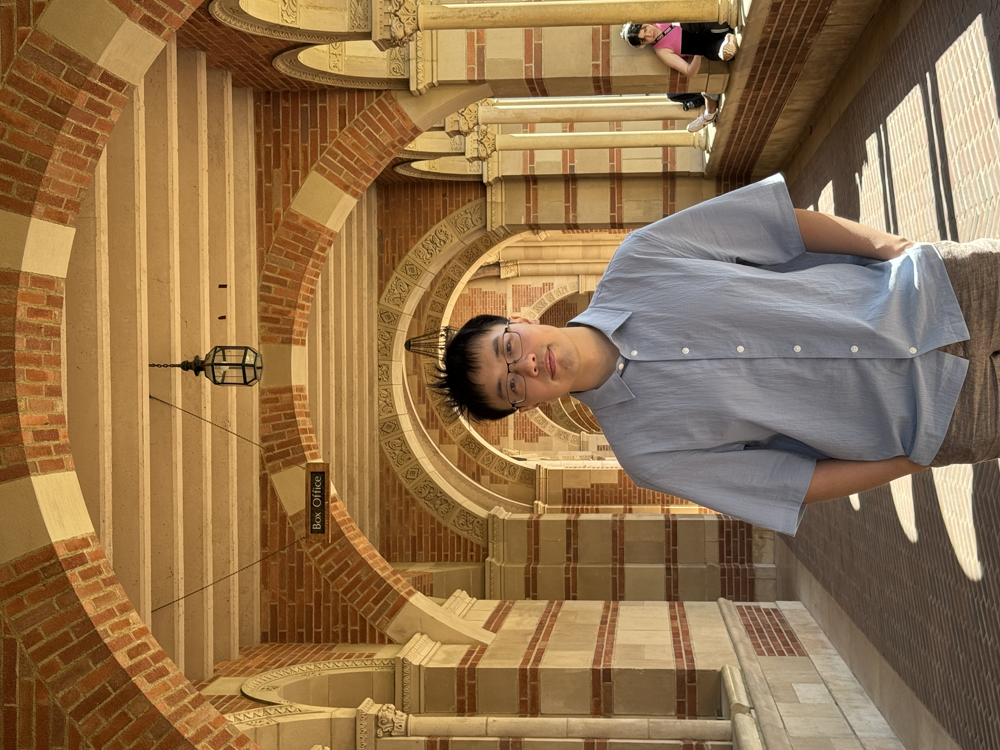

# Members

Below are active members of the Quantum Programming Community.
Each profile includes contact links, research interests, and contributions.

---

## Organizers

  

  

    <h3>John Ye — UCLA</h3>
    
<strong>Area:</strong> Quantum Systems &amp; Error Correction

    
<strong>Webpage:</strong>
      <a href="https://yezhuoyang.github.io/" target="_blank">
        https://yezhuoyang.github.io/
      </a>
    

    

      John works on scalable quantum error-correction infrastructure,
      helper-qubit-aware scheduling, and logical error-rate estimation
      methodologies for large-scale quantum processors.
    

  

---

  

  

    <h3>Jens Palsberg — Professor, UCLA</h3>

    
<strong>Webpage:</strong>
      <a href="https://web.cs.ucla.edu/~palsberg/" target="_blank">
        https://web.cs.ucla.edu/~palsberg/
      </a>
    

    

      Jens Palsberg is the faculty advisor of QuBruin.
    

  

---

# Contest Award Winners

Members listed below participated in hackathons and competitions
and contributed to award-winning projects featured on the Awards page.

(Photos use placeholders for now.)

---

## YQuantum 2025 — QuEra Track Winners

  

    
    

      <h3>Mu Niu</h3>
      

        Member of the QuEra Track winning team at YQuantum 2025.
      

    

  

  

    
    

      <h3>Victor Yu</h3>
      

        Member of the QuEra Track winning team at YQuantum 2025.
      

    

  

  

    
    

      <h3>Hanyu Wang</h3>
      

        Member of the QuEra Track winning team at YQuantum 2025.
      

    

  

  

    
    

      <h3>Haochen Wang</h3>
      

        Member of the QuEra Track winning team at YQuantum 2025.
      

    

  

---

## YQuantum 2024 — Grand Prize 3rd Place

  

    
    

      <h3>Qiyu Liu</h3>
      

        Member of the Grand Prize 3rd Place team at YQuantum 2024.
      

    

  

  

    
    

      <h3>Manvi Agrawal</h3>
      

        Member of the Grand Prize 3rd Place team at YQuantum 2024.
      

    

  

  

    
    

      <h3>Changsoo Kim</h3>
      

        Member of the Grand Prize 3rd Place team at YQuantum 2024.
      

    

  

---

## MIT Hackathon 2024 — Quandela Track Winners

  

    
    

      <h3>Yarin Heffes</h3>
      

        Member of the Quandela Track winning team at MIT Hackathon 2024.
      

    

  

  

    
    

      <h3>Roberto Negrin</h3>
      

        Member of the Quandela Track winning team at MIT Hackathon 2024.
      

    

  

